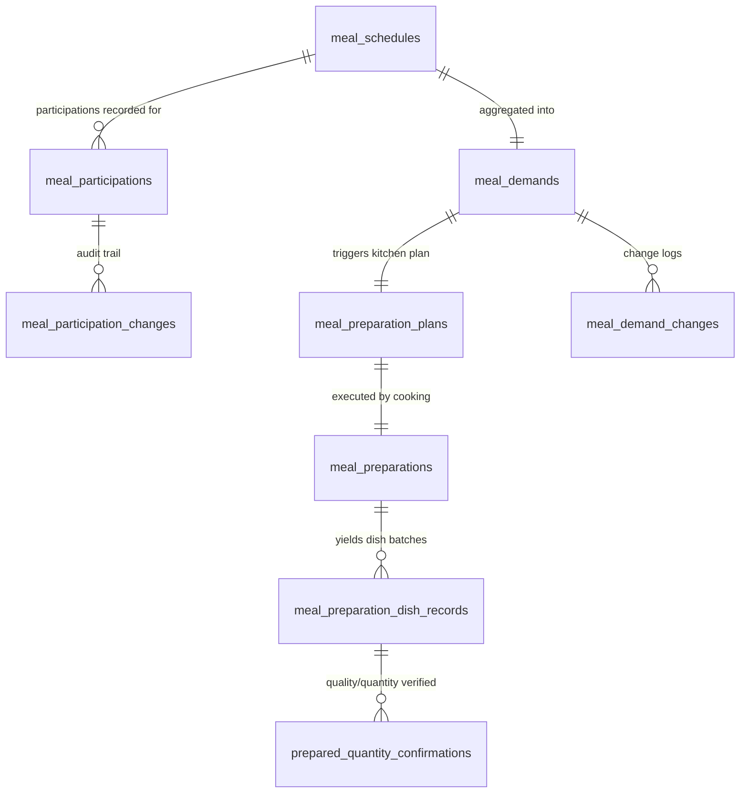
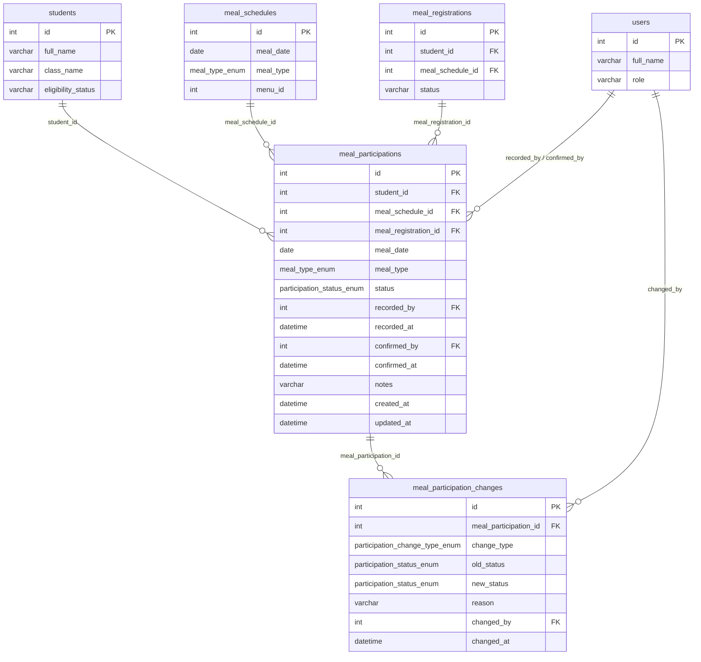
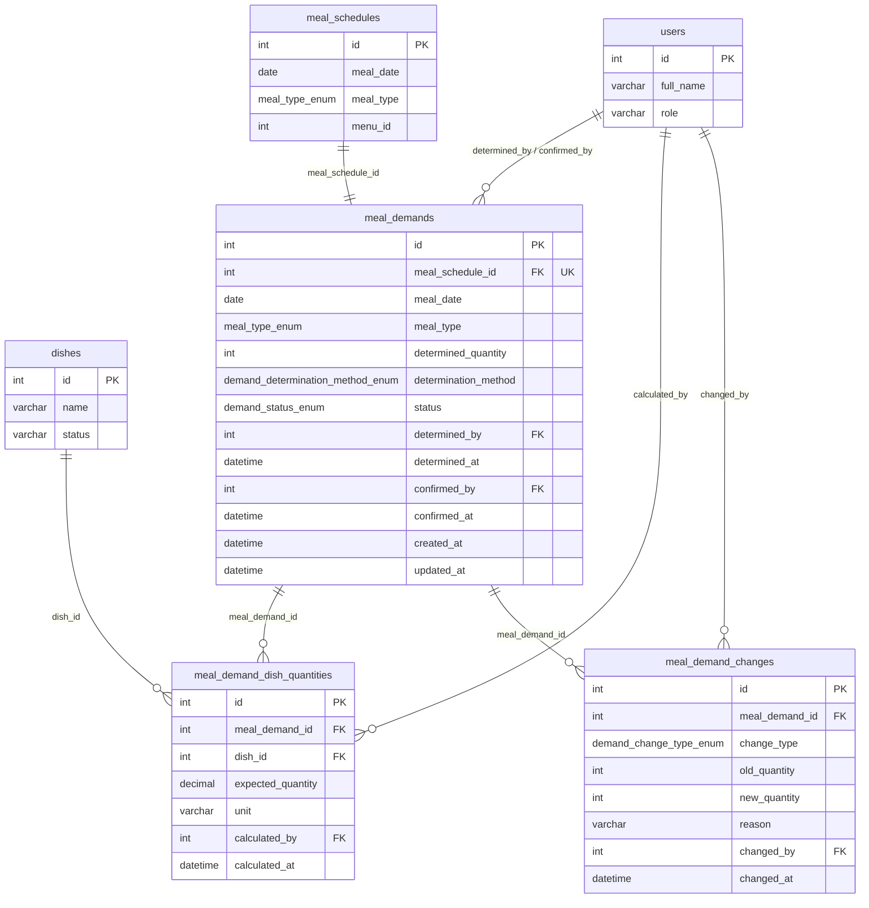
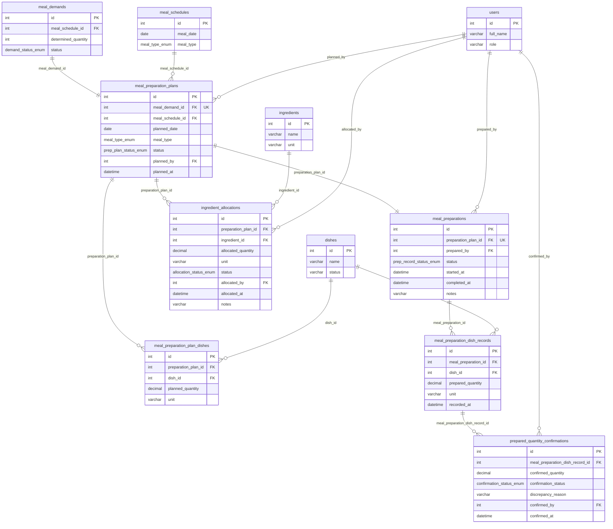

# Database ERD — Entity Relationship Diagrams

> [!TIP]
> **Interactive Visualization:** You can also explore and interact with the database diagram and relationships online at:  
> 🔗 **[dbdocs.io — PRIMARY SCHOOL SEMI-BOARDING MEAL MANAGEMENT SYSTEM](https://dbdocs.io/tqtolympia/PRIMARY-SCHOOL-SEMI-BOARDING-MEAL-MANAGEMENT-SYSTEM)**

This document contains the Entity Relationship Diagrams (ERD) supporting the three implemented core modules:
1. **Meal Participation Management**
2. **Meal Demand & Quantity Management**
3. **Meal Preparation**

---

## 1. High-Level Domain & Module Overview

The overview below illustrates how the operational flow links Student Participation to Demand Estimation, and finally into Kitchen Preparation and Verification.

---

## 2. Module 1: Meal Participation Management

Captures daily student attendance/meal consumption, handles changes (cancellation, status update, reschedule), and records supervisory confirmation.

---

## 3. Module 2: Meal Demand & Quantity Management

Aggregates individual participations into consolidated headcount demand, calculates expected dish portions based on standard recipes, and logs quantity adjustments.

---

## 4. Module 3: Meal Preparation

Transforms confirmed meal demands into executable kitchen preparation plans, allocates ingredients from pantry/inventory, tracks cooking output, and conducts quantity reconciliation.

