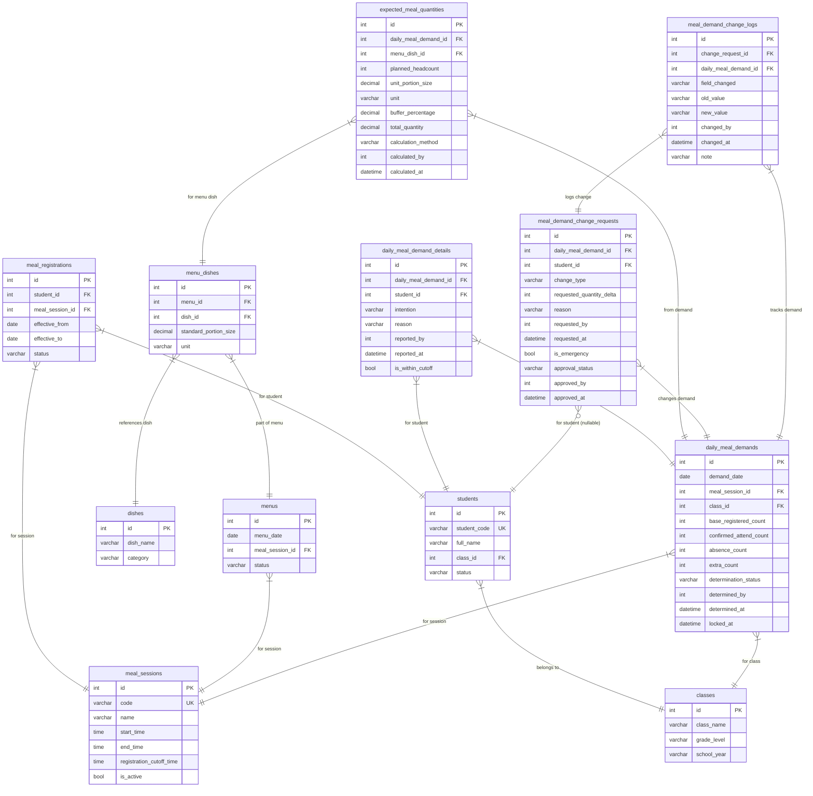

# Database ERD — Entity Relationship Diagram

**Source Feature Set:** Phase 1 Selected Core Features (F-STU-01 through F-MOP-02)

```mermaid
erDiagram

    %% ─── STUDENT MEAL MANAGEMENT ─────────────────────────────────────────
    classes {
        int     id          PK
        varchar class_name
        varchar grade_level
        varchar school_year
    }

    students {
        int     id           PK
        varchar student_code UK
        varchar full_name
        int     class_id     FK
        varchar status
    }

    meal_sessions {
        int     id                      PK
        varchar code                    UK
        varchar name
        time    start_time
        time    end_time
        time    registration_cutoff_time
        bool    is_active
    }

    meal_registrations {
        int     id              PK
        int     student_id      FK
        int     meal_session_id FK
        date    effective_from
        date    effective_to
        varchar status
    }

    %% ─── MEAL PLANNING & MENU MANAGEMENT ────────────────────────────────
    dishes {
        int     id        PK
        varchar dish_name
        varchar category
    }

    menus {
        int     id              PK
        date    menu_date
        int     meal_session_id FK
        varchar status
    }

    menu_dishes {
        int     id                  PK
        int     menu_id             FK
        int     dish_id             FK
        decimal standard_portion_size
        varchar unit
    }

    %% ─── MEAL OPERATION ──────────────────────────────────────────────────
    daily_meal_demands {
        int      id                     PK
        date     demand_date
        int      meal_session_id        FK
        int      class_id               FK
        int      base_registered_count
        int      confirmed_attend_count
        int      absence_count
        int      extra_count
        varchar  determination_status
        int      determined_by
        datetime determined_at
        datetime locked_at
    }

    daily_meal_demand_details {
        int      id                   PK
        int      daily_meal_demand_id FK
        int      student_id           FK
        varchar  intention
        varchar  reason
        int      reported_by
        datetime reported_at
        bool     is_within_cutoff
    }

    expected_meal_quantities {
        int      id                   PK
        int      daily_meal_demand_id FK
        int      menu_dish_id         FK
        int      planned_headcount
        decimal  unit_portion_size
        varchar  unit
        decimal  buffer_percentage
        decimal  total_quantity
        varchar  calculation_method
        int      calculated_by
        datetime calculated_at
    }

    meal_demand_change_requests {
        int      id                    PK
        int      daily_meal_demand_id  FK
        int      student_id            FK
        varchar  change_type
        int      requested_quantity_delta
        varchar  reason
        int      requested_by
        datetime requested_at
        bool     is_emergency
        varchar  approval_status
        int      approved_by
        datetime approved_at
    }

    meal_demand_change_logs {
        int      id                    PK
        int      change_request_id     FK
        int      daily_meal_demand_id  FK
        varchar  field_changed
        varchar  old_value
        varchar  new_value
        int      changed_by
        datetime changed_at
        varchar  note
    }

    %% ─── RELATIONSHIPS ───────────────────────────────────────────────────
    students                   }|--||  classes                    : "belongs to"
    meal_registrations         }|--||  students                   : "for student"
    meal_registrations         }|--||  meal_sessions              : "for session"

    menus                      }|--||  meal_sessions              : "for session"
    menu_dishes                }|--||  menus                      : "part of menu"
    menu_dishes                }|--||  dishes                     : "references dish"

    daily_meal_demands         }|--||  meal_sessions              : "for session"
    daily_meal_demands         }|--||  classes                    : "for class"
    daily_meal_demand_details  }|--||  daily_meal_demands         : "detail of demand"
    daily_meal_demand_details  }|--||  students                   : "for student"

    expected_meal_quantities   }|--||  daily_meal_demands         : "from demand"
    expected_meal_quantities   }|--||  menu_dishes                : "for menu dish"

    meal_demand_change_requests }|--|| daily_meal_demands         : "changes demand"
    meal_demand_change_requests }o--|| students                   : "for student (nullable)"
    meal_demand_change_logs     }|--|| meal_demand_change_requests : "logs change"
    meal_demand_change_logs     }|--|| daily_meal_demands          : "tracks demand"
```
