# System UI Visual Catalog & Screen Showcase

> High-resolution operational screen captures of the **Hoa Sen Elementary Dining Operations Platform**, categorized by user persona and mapped to the formal Screen Catalog defined in [Phase 04 (Screen Inventory)](../docs/04-information-architecture/screen-inventory.md).

---

## Directory Summary

```
screenshots/
├── README.md                      ← You are here (Visual Catalog & Screen Guide)
│
├── gv/                            ← Homeroom Teacher Role (TCH / Giáo viên)
│   ├── gv-1.png                   ← Roster summary counts, lock action & SCR-TCH-02 audit log
│   └── gv-2.png                   ← Class roster participation grid, allergy alerts & timer
│
├── qlb/                           ← Meal / Nutrition Manager Role (MGR / Quản lý Bán trú)
│   ├── qlb-1.png                  ← Demand determination dashboard & buffer percentage setup
│   ├── qlb-2.png                  ← Standard recipe dish quantity calculation & manual overrides
│   ├── qlb-3.png                  ← Post-cutoff emergency change requests triage queue
│   ├── qlb-4.png                  ← Kitchen shift preparation plan & station dispatch
│   └── qlb-5.png                  ← Finished prep summary, variance reconciliation & digital sign-off
│
└── knb/                           ← Kitchen Staff / Head Chef Role (KIT / Kiosk Nhà Bếp)
    ├── knb-1.png                  ← Shift operations kiosk dashboard & dish targets
    ├── knb-2.png                  ← Raw ingredient receiving checklist from storage pantry
    ├── knb-3.png                  ← Industrial cooking station execution & active batch timers
    └── knb-4.png                  ← Finished yield scale weighing & discrepancy verification
```

---

## 1. Homeroom Teacher Portal (`screenshots/gv/`)

The Homeroom Teacher is the frontline data source, capturing daily attendance in the classroom before morning cutoff.

### Screen SCR-TCH-01: Class Roster Attendance & Allergy Alerts
- **File:** `gv/gv-2.png`
- **Primary Screen ID:** `SCR-TCH-01`
- **Associated Use Case:** `UC-TCH-01` (Record Daily Class Attendance & Meal Participation)
- **Core Feature:** `F-PAR-01`

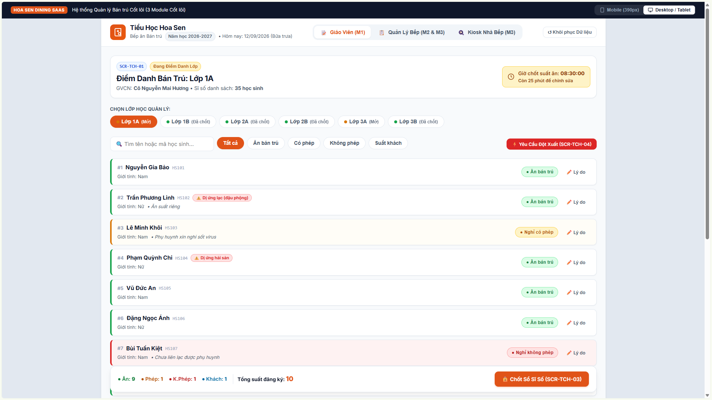

**Key Capabilities:**
- **Header Summary Card:** Displays active session information (Academic Year 2026–2027, Lunch Session, Class 1A, Homeroom Teacher name, and total enrolled headcount of 35 students).
- **Lock Countdown Timer:** Prominent visual countdown to the morning cutoff deadline (`08:30:00`), ensuring teachers finalize submissions before kitchen prep begins.
- **Class Selector Ribbon:** One-tap pills allowing administrators or supervisors to toggle between different classes with clear status badges (*Open for Attendance* vs. *Locked*).
- **Search & Quick Filter:** Real-time search by student name or student ID, combined with category filters (*All*, *Attended*, *Excused*, *Unexcused*, *Guest*).
- **Allergy Safety Badges:** Amber warning badges prominently displaying registered medical dietary conditions (e.g., student `#2 Trần Phương Linh` allergic to peanuts; student `#4 Phạm Quỳnh Chi` allergic to seafood).
- **Emergency Action:** Red trigger button activating the post-cutoff emergency request dialog (`SCR-TCH-04`).

---

### Screen SCR-TCH-01 (Bottom) / SCR-TCH-03: Roster Locking & Audit Log
- **File:** `gv/gv-1.png`
- **Primary Screen IDs:** `SCR-TCH-01`, `SCR-TCH-03`, `SCR-TCH-02 LOG`
- **Associated Use Cases:** `UC-TCH-02` (Amend Attendance), `UC-TCH-03` (Lock Roster)
- **Core Features:** `F-PAR-02`, `F-PAR-03`

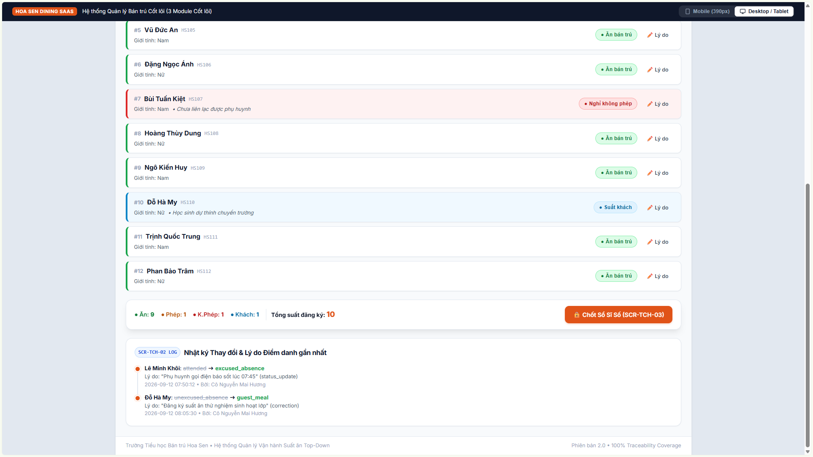

**Key Capabilities:**
- **Roster Summary Bar:** Aggregated headcount chips displaying counts by status (Attended: 9, Excused: 1, Unexcused: 1, Guest: 1, Total: 10).
- **Roster Lock Button (`SCR-TCH-03`):** High-prominence action button that locks Class 1A's headcount, transitions status to `confirmed`, and pushes live figures to the kitchen.
- **Audit Timeline Log (`SCR-TCH-02 LOG`):** Detailed chronological audit trail logging every status change with exact timestamp, previous status, updated status, reason provided, and authoring teacher identity.

---

## 2. Meal / Nutrition Manager Portal (`screenshots/qlb/`)

The Nutrition Manager aggregates classroom attendance across the school, computes ingredient demands with safety buffers, and supervises kitchen execution.

### Screen SCR-MGR-01: Demand Determination Dashboard
- **File:** `qlb/qlb-1.png`
- **Primary Screen ID:** `SCR-MGR-01`
- **Associated Use Case:** `UC-MGR-01` (Determine Daily Meal Demand)
- **Core Feature:** `F-DMD-01`

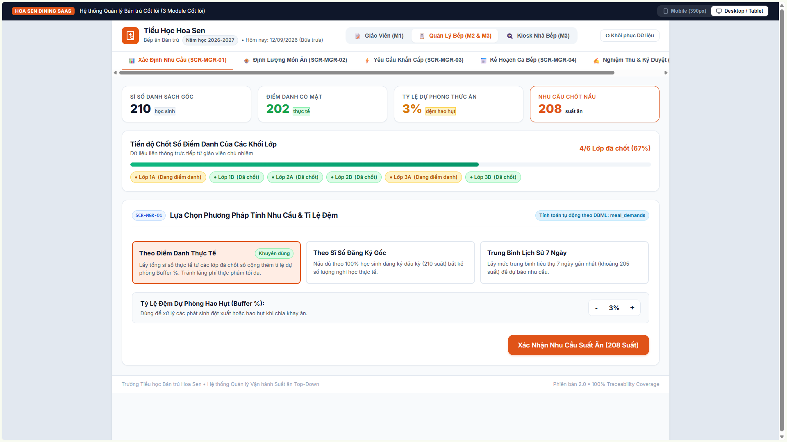

**Key Capabilities:**
- **Executive Metric Cards:** Total registered roster (210 students), confirmed actual attendance (202 students), safety buffer percentage (3%), and final target demand (208 meals).
- **Submission Progress Bar:** Visual progress tracking indicating confirmed vs. pending classrooms (4/6 classes confirmed, 67% complete).
- **Forecasting Model Selection:** Radio options allowing the manager to select the calculation basis (*Actual Attendance*, *Registered Baseline Roster*, or *7-Day Historical Moving Average*).
- **Buffer Stepper:** Precise plus/minus controls to calibrate the safety buffer percentage.
- **Demand Confirmation:** Master action button (`Xác Nhận Nhu Cầu Suất Ăn`) locking demand and generating preparation requirements.

---

### Screen SCR-MGR-02: Dish Quantity Calculation & Overrides
- **File:** `qlb/qlb-2.png`
- **Primary Screen ID:** `SCR-MGR-02`
- **Associated Use Case:** `UC-MGR-02` (Calculate Scaled Dish Quantities)
- **Core Feature:** `F-DMD-02`

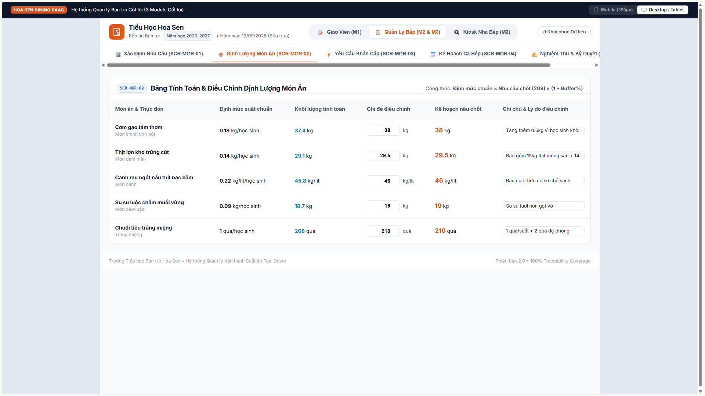

**Key Capabilities:**
- **Standardized Multiplier Formula:** Explicitly displays the underlying formula: $\text{Quantity} = \text{Standard Portion} \times \text{Final Demand} \times (1 + \text{Buffer})$.
- **Menu Course Table:** Itemizes scheduled lunch courses (Fragrant white rice, braised pork with quail eggs, Malabar spinach soup with minced pork, boiled chayote squash with sesame salt, bananas).
- **Calculated vs. Final Planned:** Shows computed baseline alongside final planned quantity.
- **Audited Manual Overrides:** Editable text inputs permitting chefs and managers to adjust batch quantities, requiring an explicit justification note for each override.

---

### Screen SCR-MGR-03: Emergency Demand Changes Review Queue
- **File:** `qlb/qlb-3.png`
- **Primary Screen ID:** `SCR-MGR-03`
- **Associated Use Case:** `UC-MGR-03` (Review Emergency Changes)
- **Core Feature:** `F-DMD-03`

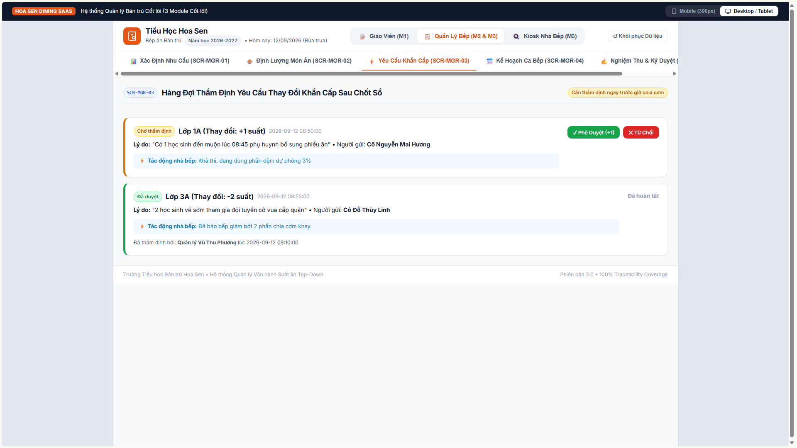

**Key Capabilities:**
- **Emergency Triage Cards:** Itemizes late changes submitted by teachers after the 08:30 cutoff (e.g., student late arrival with +1 meal request; early departure with -2 meals cancellation).
- **Kitchen Impact Analysis:** Automatic assessment indicating whether existing buffer stocks can absorb the change without requiring an additional cooking batch.
- **One-Click Decision Buttons:** Direct **Phê Duyệt (Approve)** and **Từ Chối (Reject)** actions with immediate state broadcast to the kitchen kiosk.

---

### Screen SCR-MGR-04: Kitchen Shift Preparation Planning
- **File:** `qlb/qlb-4.png`
- **Primary Screen ID:** `SCR-MGR-04`
- **Associated Use Case:** `UC-MGR-04` (Create Kitchen Shift Plan)
- **Core Feature:** `F-PRP-01`

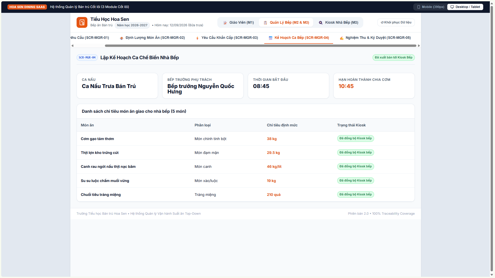

**Key Capabilities:**
- **Shift Parameters:** Designates shift type (Lunch Service), Assigned Head Chef (Nguyễn Quốc Hưng), shift start time (08:45), and meal completion deadline (10:45).
- **Dispatched Dish Targets:** Comprehensive list of required dish weights and courses synchronized directly with the industrial kitchen kiosk.
- **Sync Status:** Green status badges confirming live data transmission to kitchen displays.

---

### Screen SCR-MGR-05: Prep Summary & Discrepancy Sign-Off
- **File:** `qlb/qlb-5.png`
- **Primary Screen ID:** `SCR-MGR-05`
- **Associated Use Case:** `UC-MGR-05` (Daily Preparation Reconciliation)
- **Core Feature:** `F-PRP-04`

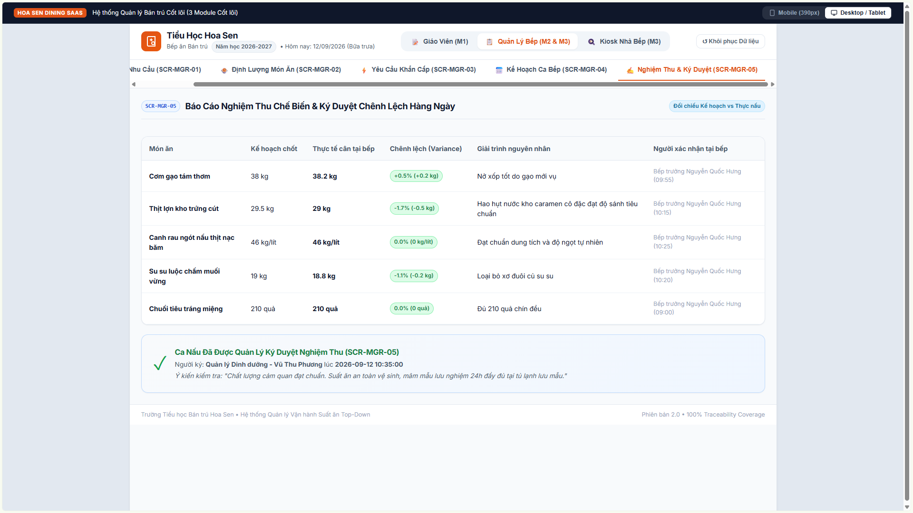

**Key Capabilities:**
- **Reconciliation Matrix:** Side-by-side comparison of planned quantity vs. actual scale weight for every prepared course.
- **Tolerance Variance Indicators:** Percentage delta chips highlighting deviations (e.g., $+0.5\%$ within acceptable limits; $-1.7\%$ within shrinkage tolerance).
- **Chef Explanations:** Display of explanations logged at the kitchen station.
- **Manager Digital Sign-Off:** Formal sign-off block recording manager identity, timestamp, and sensory inspection comments (texture, taste, and 24-hour food safety sample retention verification).

---

## 3. Kitchen Operations Kiosk Portal (`screenshots/knb/`)

Designed for wall-mounted touchscreens and rugged tablets in the central kitchen, featuring high-contrast themes and oversized controls.

### Screen SCR-KIT-01: Kitchen Shift Dashboard Kiosk
- **File:** `knb/knb-1.png`
- **Primary Screen ID:** `SCR-KIT-01`
- **Associated Use Case:** `UC-KIT-01` (View Daily Kitchen Shift Plan)
- **Core Feature:** `F-PRP-01`

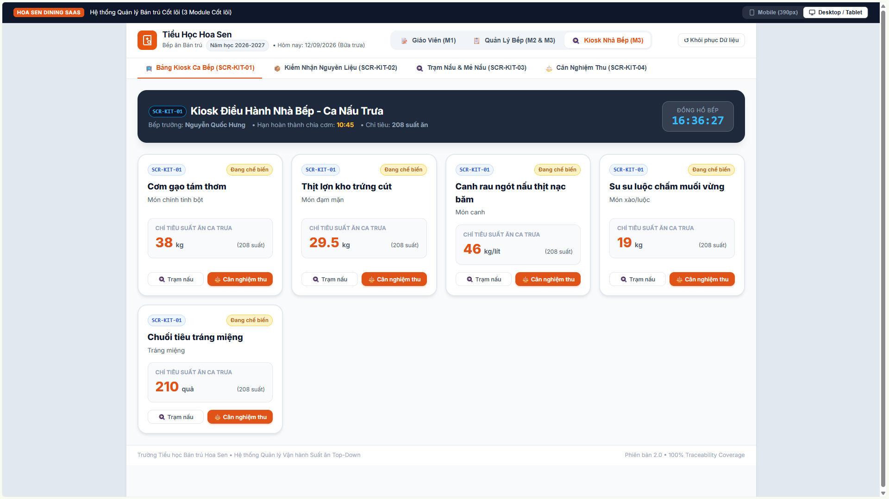

**Key Capabilities:**
- **Industrial Kiosk Layout:** Large typography and high-contrast color cards engineered for readability from across the cooking floor.
- **Live Kitchen Clock:** Prominent real-time digital clock tracking time against the 10:45 distribution deadline.
- **Target Quota Cards:** Large numerical targets for each dish course (e.g., 38 kg Rice, 29.5 kg Pork & Quail Eggs, 46 kg Soup, 19 kg Chayote, 210 Bananas).
- **Station Quick-Jumps:** Direct buttons on each card to open station cooking timers (`SCR-KIT-03`) or the weighing scale (`SCR-KIT-04`).

---

### Screen SCR-KIT-02: Ingredient Allocation Checklist
- **File:** `knb/knb-2.png`
- **Primary Screen ID:** `SCR-KIT-02`
- **Associated Use Case:** `UC-KIT-02` (Accept Allocated Ingredients)
- **Core Feature:** `F-PRP-02`

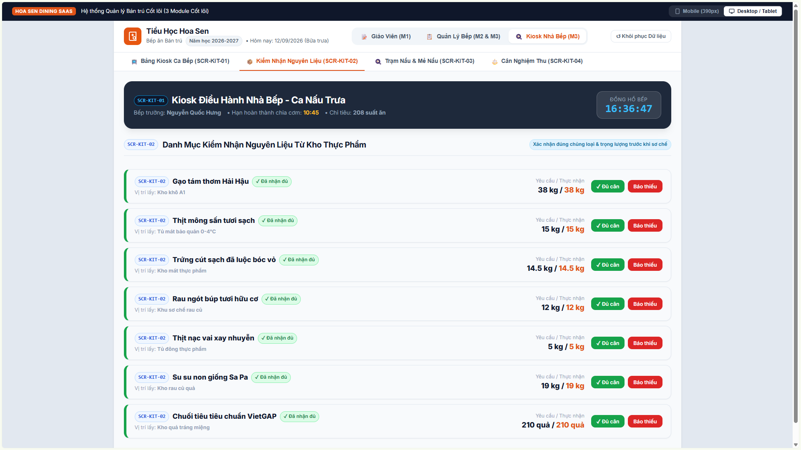

**Key Capabilities:**
- **Pantry Verification List:** Detailed inventory of raw ingredients issued from dry and cold storage with precise pantry bin locations (e.g., Dry Storage Bin A1, Chilled Cold Room 0–4°C).
- **Requested vs. Received Weights:** Displays required allocation weight vs. actual measured receiving weight.
- **Verification Actions:** Quick tap buttons for **Đủ cân (Confirmed Weight)** and **Báo thiếu (Report Shortage)**.

---

### Screen SCR-KIT-03: Industrial Cooking Stations & Active Batch Timers
- **File:** `knb/knb-3.png`
- **Primary Screen ID:** `SCR-KIT-03`
- **Associated Use Case:** `UC-KIT-03` (Execute Cooking Batches & Log Yield)
- **Core Feature:** `F-PRP-03`

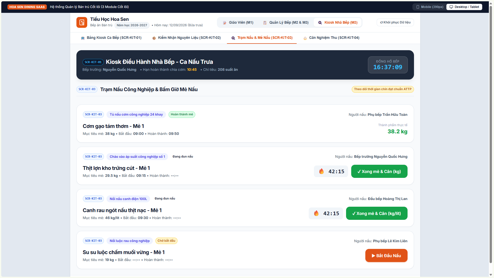

**Key Capabilities:**
- **Appliance-Segregated Stations:** Cooking stations organized by heavy appliance type (24-tray industrial steam cabinet, pressure braising skillet, 100L electric soup kettle).
- **Active Countdown Timers:** Real-time animated timer indicators ensuring critical thermal cooking durations are observed for food safety.
- **Batch State Controls:** Clear action triggers (*Bắt Đầu Nấu* to start cooking, *Xong mẻ & Cân* to complete and hand off to scale).

---

### Screen SCR-KIT-04: Prepared Quantity Verification & Scale Weighing
- **File:** `knb/knb-4.png`
- **Primary Screen ID:** `SCR-KIT-04`
- **Associated Use Case:** `UC-KIT-04` (Verify Prepared Quantities & Discrepancies)
- **Core Feature:** `F-PRP-04`

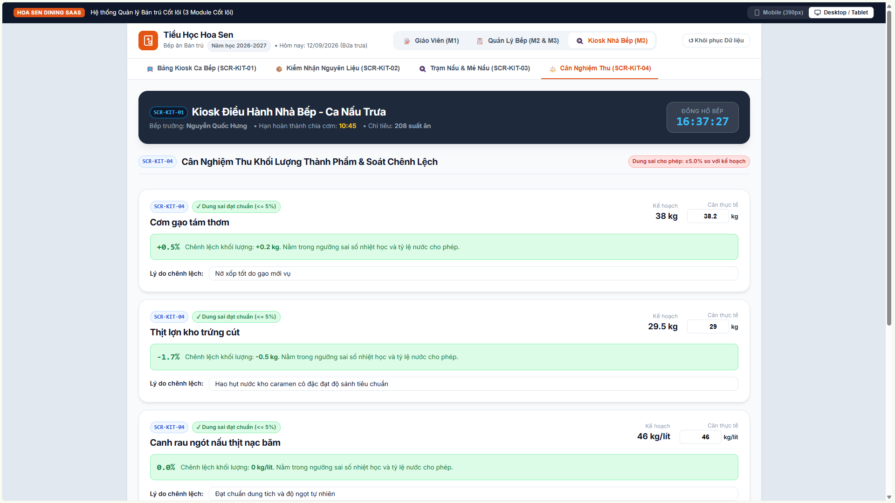

**Key Capabilities:**
- **Digital Scale Entry:** Direct numeric input of actual cooked yield weight (e.g., 38.2 kg cooked rice vs. 38 kg planned).
- **Automated Tolerance Validation:** Real-time validation against the $\pm 5.0\%$ allowable shrinkage/expansion tolerance. Green indicator confirms acceptable threshold.
- **Mandatory Discrepancy Note:** Mandatory text input capturing cooking root causes (e.g., higher expansion ratio for new rice batch; reduction moisture loss during sauce caramelization).
